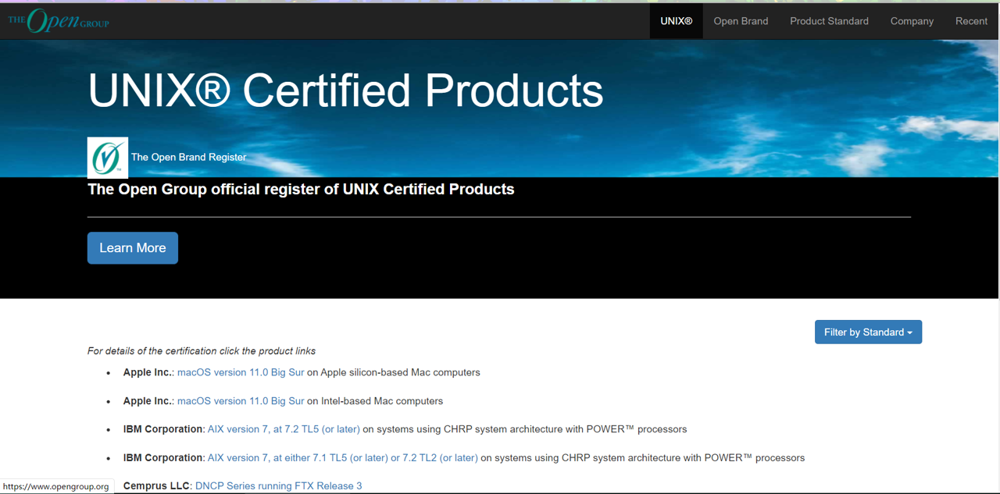

# 1.1 What is UNIX

Once upon a time it was an operating system. It was eventually created by rewriting the C language. --AT&T Inc.

Now a **standard specification and commercial trademark**. More than that, it is **a philosophical idea, a software engineering principle**.

Check it out at: [http://www.opengroup.org/openbrand/register](http://www.opengroup.org/openbrand/register)

We can now know that certifying UNIX requires.

1. conform to a single UNIX specification

2. pay for the certification

>Common certified UNIX operating systems are MacOS.

----

**Here are the details:**

## Mutlics

The CTSS (Compatible Time-Sharing System), introduced at MIT in 1964, was the most creative operating system of its time. With an efficient operating system like CTSS, MIT researchers decided to make a better version. They began designing the Multics system, which stands for Multiplexed Information and Computing Services.

Multics was intended to create powerful new software and new hardware that was more feature-rich than the IBM 7094, and MIT enlisted the help of two companies. General Electric was responsible for designing and producing computers with new hardware features that would better support time-sharing and multi-user systems, and Bell Labs had developed its own operating system early in the development of computers, so MIT invited Bell Labs to work with General Electric on Multics.

The development of Multics eventually ran into difficulties, as Multics was designed with a large number of programs and functions, often cramming many different things into it, resulting in an overly complex system. in 1969, as Bell Labs saw it as a set of information processing tools, it no longer served the lab's goal of providing computing services, and it was designed to be too expensive, so in April of the same year, Bell Labs withdrew from the Multics project. Multics project, leaving only MIT and General Electric to continue development.

## UNICS

After Bell Labs withdrew from the Multics development project, project team member Ken Thompson (Kenneth Lane Thompson) found a DEC PDP-7 computer, which was not a powerful computer, only 4KB of memory, but the graphical interface is relatively beautiful, Thompson used him to write a space game (Space Travel), PDP-7 To solve this problem, Thompson wrote a disk scheduling algorithm to increase the total disk throughput.

How to test this new algorithm? Data needed to be loaded onto the disks, and Thompson needed to write a program that wrote data in bulk.

He needed to write three programs, one for each week: an editor to create the code, a machine language assembler to convert the code to run on PDP-7, and "the outer layer of the kernel - the operating system is done.

The new PDP-7 operating system was not written for much longer, and Thompson and a few colleagues discussed the fact that the new system did not have a name at the time, when it was named "UNICS", which was eventually changed to **UNIX**, a more memorable name.

> Today, Huawei EulerOS (based on CentOS) can be certified as UNIX, so discussing whether it is UNIX or not has become tasteless and meaningless. Even Windows can be certified as UNIX for money (it also implements most of POSIX).
