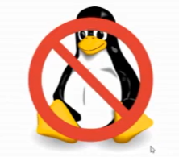
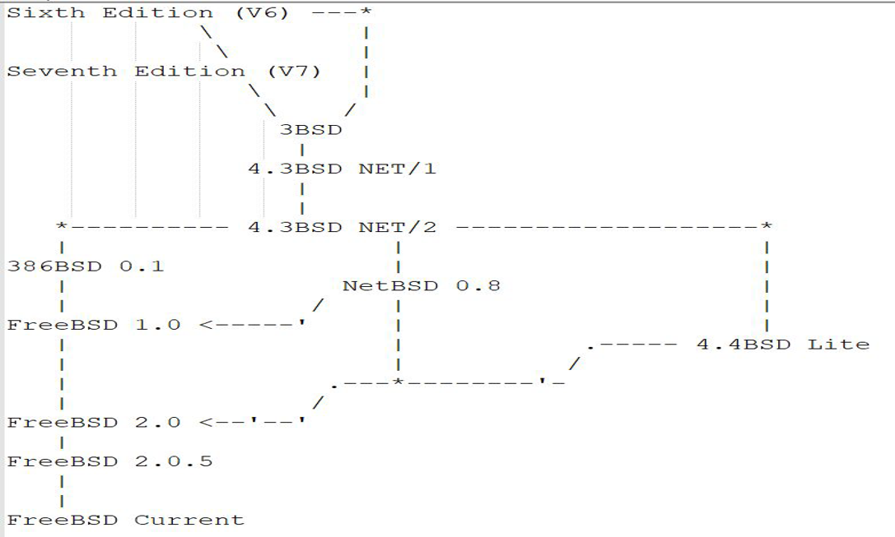

# 1.4 FreeBSD and Other Operating Systems

## What is FreeBSD?

BSD was originally developed by the University of California, Berkeley, and stands for `Berkeley Software Distribution`.

FreeBSD is not Linux, it is not a homegrown operating system, it is not Systemd compatible, it is not chicken, and it is not UNIX. Currently, FreeBSD has the largest number of users in the BSD system. Some Linux software can be found in FreeBSD, and even if you can't find it, you can run it through the CentOS compatibility layer, or you can build a debian or ubuntu /system yourself with debootstrap.

> **FreeBSD is not Linux, it is not UNIX, it is UNIX-like**

UNIX -> Networking Release 1->Networking Release 2 -> 386BSD -> FreeBSD 1.0

386BSD -> Litigation (1991-1994) -> 4.4 BSD-Lite -> FreeBSD 2.0

Linus "I have never even checked 386BSD out; when I started on Linux it wast available"

>Image source: https://github.com/freebsd/freebsd-src/blob/main/share/misc/bsd-family-tree

## FreeBSD or Others

- Linux

First of all, many of you probably came from Linux, and I have no statistical basis for saying that, but let's just say it. If you find a book that mentions FreeBSD as an example of a Linux distribution, then I personally don't recommend that you continue reading it, it's misleading and I've seen similar behavior on some catechism sites.

Strictly speaking Linux is the Linux kernel, which is a kernel and not an operating system, while FreeBSD is an operating system. FreeBSD is licensed under the BSD license, see [https://www.freebsd.org/zh\_CN/copyright/freebsd-license.html](https://www.freebsd.org/zh\_CN/copyright/freebsd-license.html). FreeBSD drivers have always been a big bug, not as big as Linux.

- macOS & iOS

Both macOS & iOS are based on FreeBSD to some extent. It's not that FreeBSD's GUI is bad, it's just that Xorg and the development direction is wrong.

First of all, both macOS and iOS are based on FreeBSD to some extent. But it's time to talk about ease of use, and FreeBSD and Linux are still the same set of Xorg, which is obviously not working. But in the spirit of your line you on the view that I can not go on ...... graphical interface is the first x3.

Is Apple's achievement of macOS, iOS or the other way around, the two achievements of Apple? For example, buying a Mac with Windows is of course a personal preference, and there is nothing to criticize. Assuming that iOS comes with Android pre-installed (which may be an inappropriate example), a significant portion of pure fruit fans will not accept it.

Ecosystem. See Windows Phone for this. So why is choosing Apple not a 1% of life? Successful commercialization plays a big role. FreeBSD doesn't even have a mirror site on the mainland, and even the official website has been blocked by China Telecom because of the word free. The ecological environment is quite predictable. And now UNIX certification is very tolerant, so what pedigree that is bullshit. Good or bad to use their own heart does not count? The reason why capitalists are capitalists is in the output and then input. For here, Apple's software is more because more people use it. How did this initial accumulation? FreeBSD a lawsuit, the initial stage is not well developed, otherwise there would be no Linux, this is linus said.

The quality of the nation needs to be improved. This is not to look down on mockery, this is an objective fact. Many college students do not even know what Android is, and some say that everything is based on MIUI. This has nothing to do with the saying that there are specialties in the field. Of course, not to say that the use of fruit is low quality, so understand the language of the people have problems.

Fruit is free from the so-called suffering philosophy of the open source community.

- Microsoft Windows

Microsoft attaches great importance to user experience, which some communities may completely ignore. As a direct result, there are slightly more places that need to be addressed by your own hands. Some people think that Windows is simple because it's all about the graphical interface. In fact this is a very false statement, Windows is very complex. For example, are you familiar with the registry? Do you know what each option means?

As for security, many people think that UNIX-like doesn't need antivirus software, but this is actually not true, and by the time you find yourself poisoned, you've already become a virus incubator. But for now, FreeBSD is far safer than Windows.

As for games and stuff, Steam is known to run fine, and java software like Minecraft runs fine.
