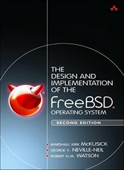
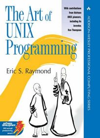
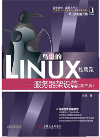

# 1.9 Bibliography and list of contributors

## Bibliography

Related books: The old ones haven't changed much. There are not as many introductory books as there are for Linux. For historical reasons, just look at UNIX-related books.

### Publications

> Tip: There are several books below that can be read for free via WeChat Reader.

>Absolute FreeBSD 3rd, by Michael W. Lucas, ISBN: 9781593278922, No Starch Press. vocabulary including content is very basic, no need to read for those who have basic computer skills.

> by Marshall McKusick, George Neville-Neil _**Design and Implementation of the FreeBSD Operating System, 2nd**_ . Mainly explains the kernel.

> by Brian W Kernighan _**UNIX: A History and a Memoir**_ . It mainly explains the history of UNIX development.

> by Eric Raymond. _**The Art of Unix Programming**_ . Mainly explains the design philosophy and software engineering theory of UNIX.

> by Eric S. Raymond. _**The Cathedral and the Bazaar**_ . Mainly describes the history of the development of the open source movement.

> Linux Private Kitchens: basic learning articles 3rd, by Bird, ISBN: 9787115226266, People's Post and Telecommunications Publishing House.
> 
> Note: There is an updated 4th edition. However, the fourth edition is written for systemd and deviates completely from the traditional init. It is still recommended to use the third edition, which is more relevant to FreeBSD. However, some of the arguments to commands such as grep will be different and are worth noting. There are some sections that are not necessary for FreeBSD and can be skipped: 0, 2, 3, 4, 15, 17, 21, 22, 23, 25, 26.

> "Linux Private Kitchens: Server Setup (3rd Edition)", by Bird, ISBN: 9787111384991, Machine Industry Press.

## List of contributors (the following rankings are in random order)

[Ling Guan](https://clansty.com)

Star No Moe

Rainy Day

[Liu Li Zhi](https://github.com/liulitchi)

[peiyafei](https://github.com/peiyafei)

[ykla](https://github.com/ykla)

bright sunny day

Shih-chan

fjh1997

X-Ray

[fanyang1997](https://github.com/fanyang1997)

[orzyyyy](https://github.com/orzyyyy)

[Rintim](https://github.com/Rintim)

[tomblackwhite](https://github.com/tomblackwhite)

isNijikawa

subway card

[Star No Moe](https://www.moebsd.cn)

[qinghecyn](https://github.com/qinghecyn)

[Qinghecyn Oral Liquid](https://linuxacme.cn)

Mozi

201724

Jack

liguangsheng

hoodie

hang yongcong

Shengyun

look up to the sky

[Mojo Sauce](https://github.com/maouchandesu)

extreme theft

[blu10ph](https://github.com/blu10ph)

livrth

**Note: If your information is missing or you don't want to be listed, please initiate an issue.**
