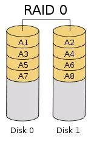

# 12.2 RAID 0

**Implementation:** The simplest way to implement RAID 0 is to connect multiple identical hard drives in series to create one large logical drive. The biggest advantage is that the capacity of the hard disk can be increased by a factor of one. If three 10T hard drives are used to form a RAID 0 mode, the disk capacity will be 30 TB.

**RAID 0 Data Recovery:** Since it does not provide data redundancy protection, the failure of one of the disks in the array will result in the loss of data in it and cannot be recovered.

**Application Scenarios:** RAID 0 is generally suitable for applications with strict performance requirements but not high data security and reliability, such as video and audio storage, temporary data cache space, etc.

**Minimum number of drives:** Minimum 2 drives required to create RAID 0

**Available Capacity:** 100% disk space utilization
