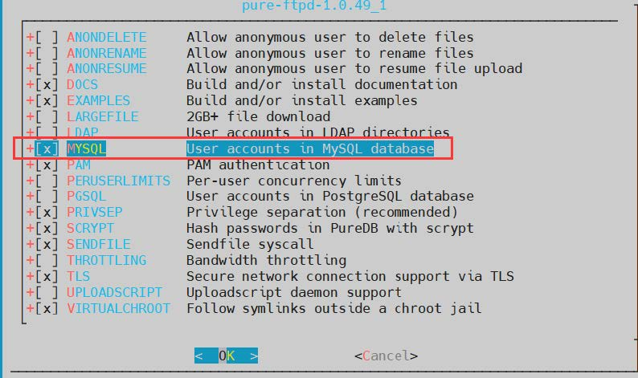

# 16.1 FTP server

FTP means File Transfer Protocol. Use FTP service to build a server to transfer files quickly.

## pure-ftpd (with MySQL support as an example)

> **Support for RFC 2640 has been removed, so FTP files under Windows are garbled, see** [**https://www.pureftpd.org/project/pure-ftpd/news/**](https://www.pureftpd.org/ project/pure-ftpd/news/) **Unable to fix, also not recommended to change the system encoding of Windows to UTF8, which will cause more garbled code, such as zip files.**
>
> **Note: This example uses mysql 5.x as an example.**

### Installation

Since the pkg package does not come with database support, you need to install the software via ports:

```
# /usr/ports/ftp/pure-ftpd
# make config-recursive
```

Check mysql and leave the rest of the options as default and enter.



```
# make install clean
```

> **Note: For basic mysql setup see Chapter 17**
>
> **Please install mysql yourself, it is theoretically compatible with mysql 5.x, 8.x**

### Configure /usr/local/etc/pure-ftpd.conf file

#### Generate configuration file.

```
# cp /usr/local/etc/pure-ftpd.conf.sample /usr/local/etc/pure-ftpd.conf
# cp /usr/local/etc/pureftpd-mysql.conf.sample /usr/local/etc/pureftpd-mysql.conf
```

#### Edit the configuration file and add mysql support to.

```
#Compatible with non-regularized ftp clients like ie

BrokenClientsCompatibility yes

# Passive connection response port range.
PassivePortRange 30000 50000

# The smallest group ID (UID) that authenticated users are allowed to log in to.
MinUID 2000

# Allow only authenticated users for FXP transfers.
AllowUserFXP yes

# User home directory is created automatically if it does not exist.
CreateHomeDir yes

# MySQL configuration file (see README.MySQL)

MySQLConfigFile /usr/local/etc/pureftpd-mysql.conf
```

### Configure mysql

#### Create database

```
create database pureftp;
use pureftp;
DROP TABLE IF EXISTS `users`;
CREATE TABLE `users` (
   `User` varchar(255) CHARACTER SET utf8mb4 COLLATE utf8mb4_bin NOT NULL,
   `Password` varchar(255) CHARACTER SET utf8mb4 COLLATE utf8mb4_bin NOT NULL,
   `Uid` int(11) NOT NULL DEFAULT -1 COMMENT '用户ID',
   `Gid` int(11) NOT NULL DEFAULT -1 COMMENT '用户组ID',
   `Dir` varchar(255) CHARACTER SET utf8mb4 COLLATE utf8mb4_bin NOT NULL,
   `quotafiles` int(255) NULL DEFAULT 500,
   `quotasize` int(255) NULL DEFAULT 30,
   `ulbandwidth` int(255) NULL DEFAULT 80,
    `dlbandwidth` int(255) NULL DEFAULT 80,
   `ipaddress` varchar(255) CHARACTER SET utf8mb4 COLLATE utf8mb4_general_ci NULL DEFAULT'*',
   `comment` int(255) NULL DEFAULT NULL,
   `status` tinyint(4) NULL DEFAULT 1,
   `ulratio` int(255) NULL DEFAULT 1,
   `dlratio` int(255) NULL DEFAULT 1,
   PRIMARY KEY (`User`) USING BTREE
) ENGINE = InnoDB CHARACTER SET = utf8mb4 COLLATE = utf8mb4_general_ci ROW_FORMAT = Dynamic;
INSERT INTO `users` VALUES ('demo', 'demo&2022*', 2002, 2000, '/home/www/demo', 500, 30, 80, 80, '*', NULL, NULL, 1, 1);
```

#### Create login database user and set password

```
grant select,insert,update,delete on pureftp.* to pftp@localhost identified by "Ab123456&";
```

### Configure `/usr/local/etc/pureftpd-mysql.conf`

```
##############################################
# #
# Sample Pure-FTPd Mysql configuration file. #
# See README.MySQL for explanations. #
# #
##############################################


# Optional : MySQL server name or IP. Don't define this for unix sockets.

# MYSQLServer 127.0.0.1
MYSQLServer localhost


# Optional : MySQL port. Don't define this if a local unix socket is used.

MYSQLPort 3306


# Optional : define the location of mysql.sock if the server runs on this host.

MYSQLSocket /var/run/mysqld/mysqld.sock


# Mandatory : user to bind the server as.

MYSQLUser pftp


# Mandatory : user password. You must have a password.

MYSQLPassword Ab123456&


# Mandatory : database to open.

MYSQLDatabase pureftpd


# Mandatory : how passwords are stored
# Valid values are : "cleartext", "argon2", "scrypt", "crypt", "sha1", "md5",password" and "any"

# ("password" = MySQL password() function, which is sha1(sha1(password)))

#MYSQLCrypt scrypt
MYSQLCrypt cleartext


# In the following directives, parts of the strings are replaced at
# run-time before performing queries :
#
# \L is replaced by the login of the user trying to authenticate.
# \I is replaced by the IP address the user connected to.
# \P is replaced by the port number the user connected to.
# \R is replaced by the IP address the user connected from.
# \D is replaced by the remote IP address, as a long decimal number.
#
# Very complex queries can be performed using these substitution strings,
# especially for virtual hosting.

# Query to execute in order to fetch the password

MYSQLGetPW SELECT Password FROM users WHERE User='\L'


# Query to execute in order to fetch the system user name or uid
MYSQLGetUID SELECT Uid FROM users WHERE User='\L'


# Optional : default UID - if set this overrides MYSQLGetUID

MYSQLDefaultUID 2000


# Query to execute in order to fetch the system user group or gid

MYSQLGetGID SELECT Gid FROM users WHERE User='\L'


# Optional : default GID - if set this overrides MYSQLGetGID

MYSQLDefaultGID 2000


# Query to execute in order to fetch the home directory

MYSQLGetDir SELECT Dir FROM users WHERE User='\L'


# Optional : query to get the maximal number of files
# Pure-FTPd must have been compiled with virtual quotas support.

# MySQLGetQTAFS SELECT QuotaFiles FROM users WHERE User='\L'


# Optional : query to get the maximal disk usage (virtual quotas)
# The number should be in Megabytes.
# Pure-FTPd must have been compiled with virtual quotas support.

# MySQLGetQTASZ SELECT QuotaSize FROM users WHERE User='\L'


# Optional : ratios. The server has to be compiled with ratio support.

# MySQLGetRatioUL SELECT ULRatio FROM users WHERE User='\L'
# MySQLGetRatioDL SELECT DLRatio FROM users WHERE User='\L'


# Optional : bandwidth throttling.
# The server has to be compiled with throttling support.
# Values are in KB/s .

# MySQLGetBandwidthUL SELECT ULBandwidth FROM users WHERE User='\L'
# MySQLGetBandwidthDL SELECT DLBandwidth FROM users WHERE User='\L'


# Enable ~ expansion. NEVER ENABLE THIS BLINDLY UNLESS :
# 1) You know what you are doing.
# 2) Real and virtual users match.

# MySQLForceTildeExpansion 1


# If you're using a transactionnal storage engine, you can enable SQL
# transactions to avoid races. Leave this commented if you are using the
# traditional MyIsam engine.

# MySQLTransactions On
```

### Add ftp group and user

```
# pw groupadd ftpgroup -g 2000
# pw useradd ftpuser -u 2001 -g 2000
```

or

```
# pw useradd ftpuser -u 2001 -g 2000 -s /sbin/nologin -w no -d /home/vftp -c "VirtualUser Pure-FTPd" -m
```

### Configuring FTP directories

```
# mkdir /home/www/pureftp
# chown -R ftpuser /home/www/
# chgrp -R ftpgroup /home/www/
```

### Service Operations

```
# sysrc pureftpd_enable="YES"
# service pure-ftpd start   #Start the server
# service pure-ftpd stop    #stop the server
# service pure-ftpd restart #restart the server
```

## proftpd (with mysql support as an example)


## Install proftpd (with mysql support as an example)

```
# pkg install proftpd proftpd-mod_sql_mysql
```

### edit /usr/local/etc/proftpd.conf

```
# cat /usr/local/etc/proftpd.conf
ServerName "Test Ftp Server"
ServerType standalone
DefaultServer on
ServerIdent on "FTP Server ready"
DeferWelcome off
Port 21
Umask 022
TimeoutLogin 300
TimeoutIdle 36000
TimeoutNoTransfer 36000
TimeoutStalled 36000
TimeoutSession 0
User proftpd
Group proftpd
MaxInstances 100
MaxClientsPerHost 100
AllowRetrieveRestart on
AllowStoreRestart on
AllowOverwrite on
AllowOverride off
RootLogin off
IdentLookups off
UseReverseDNS off
DenyFilter \*.*/
TimesGMT off
DefaultRoot ~
#RLimitCPU 1200 1200
RLimitMemory 256M 256M
RLimitOpenFiles 1024 1024
PassivePorts 50000 60000
LogFormat default "%h %l %u %t \"%r\" %s %b"
LogFormat auth "%v [%P] %h %t \"%r\" %s"
LogFormat write "%h %l %u %t \"%r\" %s %b"
SystemLog /var/log/proftpd/proftpd.log
TransferLog /var/log/proftpd/xfer.log
ExtendedLog /var/log/proftpd/access.log WRITE,READ write
ExtendedLog /var/log/proftpd/auth.log AUTH auth
LoadModule mod_sql.c
LoadModule mod_sql_mysql.c
<Global>
   SQLConnectInfo proftpd@localhost proftpd proftpd_password
   SQLAuthTypes Crypt
   SQLUserInfo users username password uid gid homedir NULL
   SQLDefaultGID 2000
   SQLDefaultUID 2000
   RequireValidShell off
   SQLAuthenticate users*
   SQLLogFile /var/log/proftpd.log
   SQLNamedQuery getcount SELECT "count, username from users where username='%u'"
   SQLNamedQuery updatecount UPDATE "count=count+1 WHERE username='%u'" users
   SQLShowInfo PASS "230" "You've logged on %{getcount} times, %u"
   SQLLog PASS updatecount
   SQLLog DELE,RETR,STOR, log_work
   SQLNamedQuery log_work FREEFORM "\
   INSERT INTO worklog (\
   user_name,\
   file_and_path,\
   bytes,\
   send_time,\
   client_ip,\
   client_name,\
   client_command) \
  VALUES('%u','%f','%b','%T','%a','%h','%m')"
</Global>
```

We specify in the settings that the server will work on port 21 in active mode and in the range of 50000-60000 in passive mode. These ports should be open in the firewall. For PF, this is done by the following rules.

```
pass in quick on $ext_if proto tcp from any to $ext_if port { 21, 50000:60000 }
```

### Create User

For security purposes, we will run Proftpd as a non-root user. Therefore, we will create this user.

```
# adduser
Username: proftpd
Full name: FTP User
Uid (Leave empty for default):
Login group [proftpd]:
Login group is proftpd. Invite proftpd into other groups? []:
Login class [default]:
Shell (sh csh tcsh bash nologin) [sh]: nologin
Home directory [/home/proftpd]:
Home directory permissions (Leave empty for default):
Use password-based authentication? [yes]: no
Lock out the account after creation? [no]:
Username : proftpd
Password : <disabled>
Full Name : FTP User
Uid : 2000
Class :
Groups : proftpd
Home : /home/proftpd
Shell : /usr/sbin/nologin
Locked : no
OK? (yes/no): yes
adduser: INFO: Successfully added (proftpd) to the user database.
Add another user? (yes/no): no
Goodbye!
```

Now you have created your own proftpd user and group ID. So you will use it when adding ftp users. You can determine the UID in the following way.

```
# cat /etc/passwd | grep proftpd
proftpd:*:2000:2000:FTP User:/home/proftpd:/usr/sbin/nologin
```

### Logging related

Create a directory to store the FTP server's logs in.

```
# mkdir /var/log/proftpd
```

Create a MySQL database and a user with full access rights to the created database:

```
CREATE DATABASE `proftpd` CHARACTER SET utf8 COLLATE utf8_general_ci;
```

Create the database user and password (to authorize the proftpd database).

```
grant select,insert,update,delete on proftpd.* to pftp@localhost identified by "123456";
FLUSH PRIVILEGES;  #Effective immediately permission
```

or

```
grant select,insert,update,delete on *.* to pftp@"localhost" Identified by "123456";
```

Volume of data created.

```
DROP TABLE IF EXISTS users;
CREATE TABLE `users` (
   `username` varchar(30) NOT NULL DEFAULT '',
   `descr` text CHARACTER SET utf8mb4 COLLATE utf8mb4_general_ci NOT NULL,
   `password` varchar(30) NOT NULL DEFAULT '',
   `uid` int(11) DEFAULT NULL,
   `gid` int(11) DEFAULT NULL,
   `homedir` varchar(255) DEFAULT NULL,
   `shell` varchar(255) DEFAULT NULL,
   `count` int(11) NOT NULL DEFAULT '0',
  UNIQUE KEY `username` (`username`)
) ENGINE=MyISAM DEFAULT CHARSET=utf8mb4;
DROP TABLE IF EXISTS worklog;
CREATE TABLE worklog (
   id bigint(20) UNSIGNED NOT NULL AUTO_INCREMENT,
   date timestamp(0) NULL DEFAULT CURRENT_TIMESTAMP(0),
   user_name varchar(20) CHARACTER SET utf8mb4 COLLATE utf8mb4_general_ci NULL DEFAULT NULL,
   file_and_path varchar(1024) CHARACTER SET utf8mb4 COLLATE utf8mb4_general_ci NULL,
   bytes bigint(20) NULL DEFAULT NULL,
   send_time varchar(9) CHARACTER SET utf8mb4 COLLATE utf8mb4_general_ci NULL DEFAULT NULL,
   client_ip varchar(15) CHARACTER SET utf8mb4 COLLATE utf8mb4_general_ci NULL DEFAULT NULL,
   client_name text CHARACTER SET utf8mb4 COLLATE utf8mb4_general_ci NULL,
   client_command varchar(5) CHARACTER SET utf8mb4 COLLATE utf8mb4_general_ci NULL DEFAULT NULL,
   PRIMARY KEY (id) USING BTREE,
   UNIQUE INDEX id(id) USING BTREE
) ENGINE = MyISAM CHARACTER SET = utf8mb4 COLLATE = utf8mb4_general_ci ROW_FORMAT = DYNAMIC;
```

Create a directory and a test FTP user, designating the created directory as the user directory:.

```
# mkdir -p /home/www/ftp
# chown -R proftpd:proftpd /home/www/ftp
# mysql -u proftpd -p
INSERT INTO `proftpd`.`users` (`username` , `descr` , `password` , `uid` , `gid` ,`homedir` , `shell` , `count` ) VALUES ('test', 'Test user', ENCRYPT('FTPpassword_here' ) , '2000', '2000', '/home/www/ftp', NULL , '0' );

Query OK, 1 row affected, 1 warning (0.02 sec)
```

### Service Operation

```
# sysrc  proftpd_enable="YES"

# service proftpd start #Start the server

# service proftpd stop #Stop the server

# service proftpd restart #Restart the server
```

## Connecting to an FTP server

Simple example:

```
# telnet localhost 21
Trying 127.0.0.1...
Connected to localhost.
Escape character is '^]'.
220 FTP Server ready
quit
221 Goodbye.
```

Use the `ftp` command to quickly connect to an FTP server.

Usage:

```
ftp [option] [URL]
```

Options.

`-4` Force a connection using the IPv4 protocol

`-6` Force connection using IPv6 protocol

`-a` Use anonymous login

`-q` \[quittime] Automatically drop the connection if it fails after a set time

`-r` \[wait] Send connection requests every `wait` seconds

`-A` force active mode

`-d` Enable debug mode

`-v` Enable verbose mode

`-V` turn off verbose mode

#### Login with the following command.

```
account [passwd] submit additional password

append [locol-file] [remote-file] Upload local file to server with remote-file as filename local-file

ascii Set the FTP file transfer type to ASCII mode.

bell Beep after the file is transferred

bye End the session with the server

cd switch directories

cdup Return to the parent directory

delete Delete the file

dir Shows the files and folders in this directory

features Show the features supported by the server

get remote-fil Download the remote-file on the server
```
