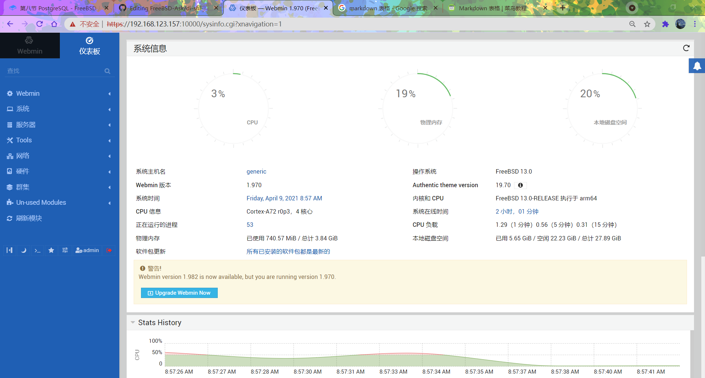

# 16.10 Webmin

```
# pkg install webmin # install webmin
# /usr/local/lib/webmin/setup.sh # Start webmin installation wizard, SSL needs to be configured to be on.
```

```
# sysrc webmin_enable="YES"
# service webmin start
```

Next, open your browser and type `https://Ip:10000`, such as `https://192.168.123.157:10000`

If the browser says it is not safe, select "Continue" and the Webmin login screen will appear.

This is the administration console. Enter `admin` and password in the text box, and click `Sign In` to log in to the console.



**Setting Chinese.**

Webmin -> Change Language and Theme, in the `Webmin UI language` field of `Change Language and Theme`, first select `Personal choice` and then select `Simplified Chinese(ZH_CN.UTF8 )` Click the ` Make Changes` button, then click the menu `->Dashboard` and the console will be refreshed to Chinese.
