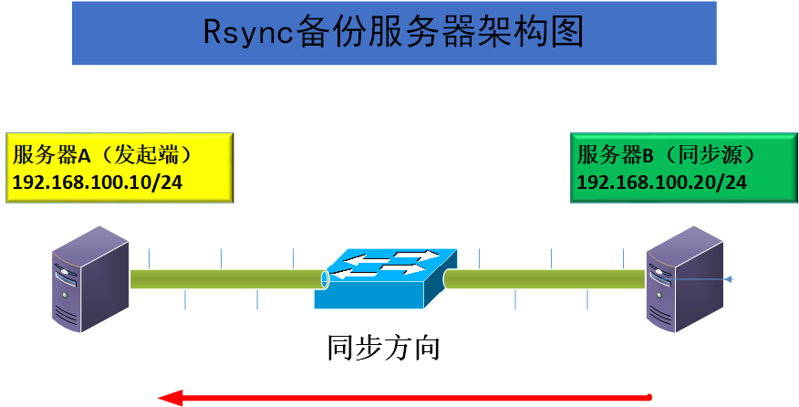

# 16.11 rsync synchronization service



## Environment introduction

Server A, Server B both `FreeBSD-12.2-RELEASE-amd64`

Server A (initiator): `192.168.100.10/24`

Server B (synchronization source): `192.168.100.20/24`

**Requirements** : To synchronize data from Server B to Server A

## Server B (sync source) configuration

### Install rsync package

```
## pkg install -y rsync
```

### Query for information on installed rsync packages

```
# pkg info | grep rsync 
rsync-3.2.3            
```

### Create a new `test` folder to be backed up and set its owner to `root` and create a new test file inside it

```
# mkdir test
# chown root /home/test/
# touch txt001 /home/test/
```

### Edit the `rsyncd.conf` file

```
# ee /usr/local/etc/rsync/rsyncd.conf

uid = root // user of the server OS
gid = wheel // group of the server OS user
use chroot = yes //banned in the source directory
address = 192.168.100.20 //listening address
port 873 // TCP port for communication, the default is 873
log file = /var/log/rsyncd.log //log file location
pid file = /var/run/rsyncd.pid //file location for archived process IDs
hosts allow = 192.168.100.0/24 //addresses of clients allowed to access

[testcom] // name of the shared module, a custom name, not necessarily the same as the sync directory
path = /home/test //name of the synchronized directory, must be the user specified by the uid parameter and the group specified by the gid parameter
comment = testcombackup //module description text     
read only = yes // whether to be read only
dont compress = *.gz *.tgz *.zip *.z *.Z *.rpm *.deb *.bz2 //the type of file that is no longer compressed when synchronizing

auth users = root //authorized accounts
secrets file = /etc/rsyncd_users.db //define the password file for rsync client user authentication
```

### Create password file for authorized backup account authentication

```
# ee /etc/rsyncd_users.db

root:12345678 //format: authorized account username:password
```

#### Modify data file permissions

```
# chmod 600 /etc/rsyncd_users.db
```

**rsync's service name is rsyncd, start the rsync service program**

```
# rsync --daemon // start the service

# sysnc rsyncd_enable="YES" //set boot-up

# /usr/local/etc/rc.d/rsyncd start //start the service
```

#### **View rsync running port number**

```
# sockstat | grep rsync
root rsync 1185 4 dgram -> /var/run/logpriv
root rsync 1185 5 tcp4 192.168.100.20:873 *:* 
```

#### **Firewall release for rsync service**

```
# ee /etc/ipfw.rules 

IPF="ipfw -q add"
ipfw -q -f flush

#loopback 
$IPF 10 allow all from any to any via lo0
$IPF 20 deny all from any to 127.0.0.0/8
$IPF 30 deny all from 127.0.0.0/8 to any
$IPF 40 deny tcp from any to any frag

# statefull
$IPF 50 check-state
$IPF 60 allow tcp from any to any established
$IPF 70 allow all from any to any out keep-state
$IPF 80 allow icmp from any to any

# open port for ssh
$IPF 110 allow tcp from any to any 22 out
$IPF 120 allow tcp from any to any 22 in

# open port for rsync
$IPF 130 allow tcp from any to any 873 in  

# deny and log everything 
$IPF 500 deny log all from any to any
```

## Server A (initiator) configuration

### **Create local folder `/home/testBackUp/` and set permissions for it**

```
## mkdir testBackUp
# chown root:root testBackUp
```

### **The initiator accesses the sync source and downloads the files to the local `/home/testBackUp/` download directory, requiring human interaction to manually enter the password**

```
# rsync -avz root@192.168.100.20::testcom /home/testBackUp     
```

### Check sync status

```
# ls -l /home/testBackUp/
total 0
-rw-r--r-- 1 root root 0 Feb 2 22:27 txt001
```
