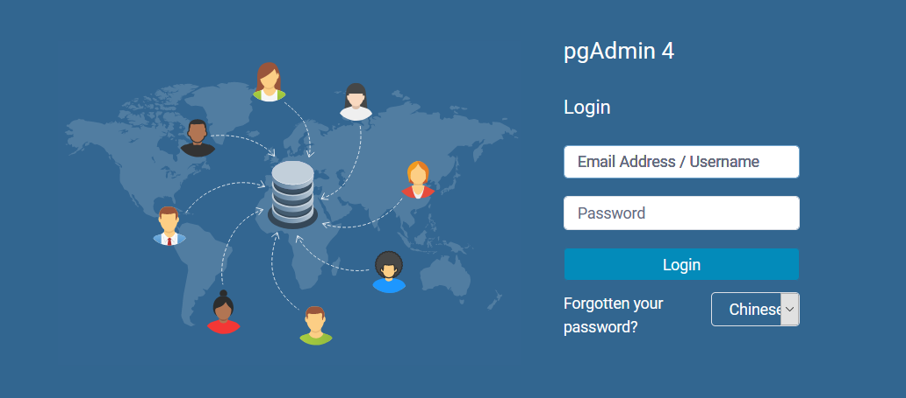
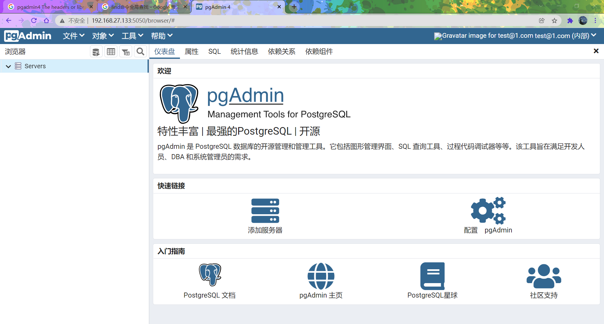
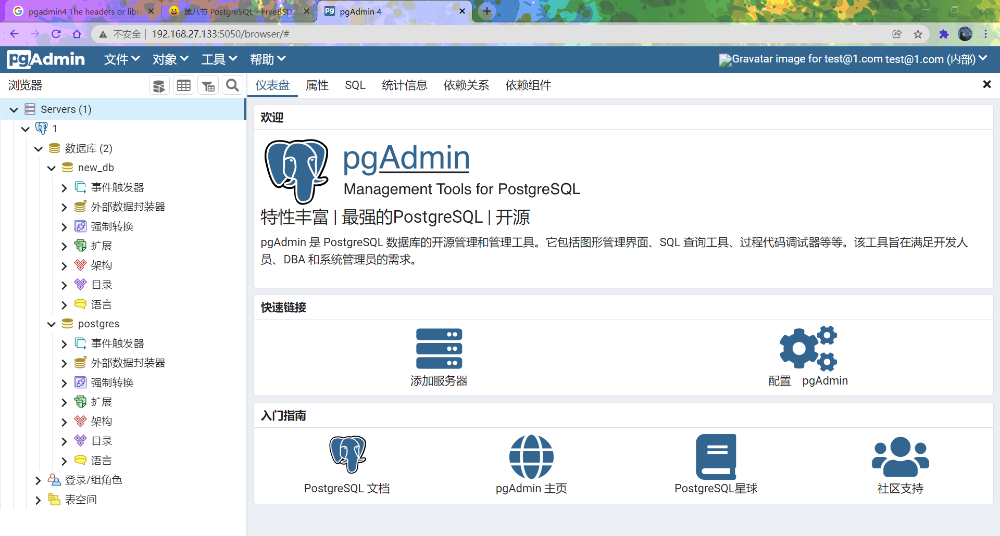

# 17.8 PostgreSQL and pgAdmin4

## PostgreSQL

PostgreSQL is a free object-relational database, first released in June 1989.
On FreeBSD, a total of 6 major releases are available, 9.6, 10, 11, 12, 13, and 14.

### postgresql installation example, for all 6 versions.

#### installation

```
## pkg install -y postgresql96-server
```

or

```
cd /usr/ports/databases/postgresql96-server/ && make install clean
```

#### add boot items

```
# sysrc postgresql_enable=YES
```

#### Initialize the database

```
/usr/local/etc/rc.d/postgresql initdb
```

Example output.

```
root@ykla:~ # /usr/local/etc/rc.d/postgresql initdb
The files belonging to this database system will be owned by user "postgres".
This user must also own the server process.

The database cluster will be initialized with locales
  COLLATE:  C
  CTYPE:    C.UTF-8
  MESSAGES: C.UTF-8
  MONETARY: C.UTF-8
  NUMERIC:  C.UTF-8
  TIME:     C.UTF-8
The default text search configuration will be set to "english".

Data page checksums are disabled.

creating directory /var/db/postgres/data96 ... ok
creating subdirectories ... ok
selecting default max_connections ... 100
selecting default shared_buffers ... 128MB
selecting default timezone ... PRC
selecting dynamic shared memory implementation ... posix
creating configuration files ... ok
running bootstrap script ... ok
performing post-bootstrap initialization ... ok
syncing data to disk ... ok

WARNING: enabling "trust" authentication for local connections
You can change this by editing pg_hba.conf or using the option -A, or
--auth-local and --auth-host, the next time you run initdb.

Success. You can now start the database server using:

    /usr/local/bin/pg_ctl -D /var/db/postgres/data96 -l logfile start

root@ykla:~ # 
```

#### Login Usage

Postgresql does not have a root user by default, so you need to log in with the postgres user it created.

Example output:

```
root@ykla:~ # psql
psql: FATAL: role "root" does not exist
```

Correct usage.

```
# switch users
root@ykla:~ # su - postgres  

# Start the service
$ /usr/local/bin/pg_ctl -D /var/db/postgres/data96 -l logfile start

# Create a new user ykla and set a password
$ createuser -sdrP ykla
Enter password for new role: 
Enter it again: 
$ 
# create database
$ createdb new_db
# Log in to the database and give database privileges to user ykla.
$ psql
psql (9.6.24)
Type "help" for help.

postgres=# ALTER USER ykla WITH ENCRYPTED PASSWORD 'password';
ALTER ROLE
postgres=# 
postgres=# GRANT ALL PRIVILEGES ON DATABASE new_db TO ykla;
GRANT
# Quit the database
postgres=# q
$exit
root@ykla:~ #
```

## Installing pgAdmin4

The following tutorial is based on FreeBSD 13.0.

pgAdmin4 is the most popular open source application for managing PostgreSQL database servers. pgAdmin4 provides a feature-rich graphical user interface to easily manage databases. It is written in Python and Javascript/ jQuery. It can be used in multiple environments such as Linux, Windows, Unix, and can be used in both desktop and server mode.

**Note: Install the PostgreSQL database before installing pgAdmin4, otherwise the installation of pgAdmin4 will fail.** pgAdmin4 needs to be installed in python.

pgAdmin4 needs to run in python environment, and the installation should be done via pip of python, so install python first.
The default version used in this article is Python 3.8. Please note that there is no python environment on FreeBSD 13 by default.
This can be viewed with the following command.

```
# python
python: Command not found # means there is no python command
```

### Install Python and pip

```
# pkg install python
```

pip is the package manager for Python packages. It is used to install and manage the relationship between Python packages and dependent packages.

virtualenv is used to create a virtual python environment, a python environment dedicated to the project.

The actual installation in this article was done by creating a separate Python environment via virtualenv to install pgAdmin4.

To install pip from the py38-pip package.

```
# pkg install py38-pip   
```

### Installing and configuring virtualenv

Use virtualenv to create a standalone Python environment. 
Virtualenv creates an environment for your own Python installation; it does not support libraries with a global or another virtual environment. 
Run the following command to install Virtualenv.

```
# pkg install py38-virtualenv (this installation is python version 3.8 so use py38)
```

Create a virtual environment for pgAdmin4 by running the following command

```
# virtualenv-3.8 pgadmin4
```

If the creation is complete, the following display shows that a virtual environment named `pgadmin4` has been created in the root directory of the root user.

```
Using base prefix '/usr/local'
New python executable in /home/vagrant/pgadmin4/bin/python3.8
Also creating executable in /home/vagrant/pgadmin4/bin/python
Installing setuptools, pip, wheel...done.
done.
```

### Installing sqlite3

```
## pkg install py38-sqlite3
```

Activate the created virtual environment.

```
#source pgadmin4/bin/activate.csh 
```

You will see that the shell has changed to (pgadmin4) (the following actions are performed under this shell)

The example is as follows.

```
(pgadmin4) root@ykla:~ # 
```

### Installing pgAdmin4.

The pip source now always requires https, which still needs to be installed due to the lack of SSL certificates.

```
(pgadmin4) root@ykla:~# pkg install ca_root_nss
```

Then change the source for pip, here use Tsinghua source.

```
pip config set global.index-url https://pypi.tuna.tsinghua.edu.cn/simple
```

There is a dependency on openjpeg, install it first

```
(pgadmin4) root@ykla:~# pkg install openjpeg
```

If an error is reported.


```
WARNING: Retrying (Retry(total=3, connect=None, read=None, redirect=None, status=None)) after connection broken by 'SSLError( SSLCertVerificationError(1, '[SSL: CERTIFICATE_VERIFY_FAILED] certificate verify failed: certificate is not yet valid (_ssl.c:1136)')': / simple/pgadmin4/
```

This is caused by incorrect time, synchronize the time first:

```
ntpdate ntp.api.bz
(pgadmin4) root@ykla:~# ntpdate ntp.api.bz
17 Dec 16:35:36 ntpdate[1453]: step time server 114.118.7.161 offset +401965.911037 sec
```

Then install pgAmdin4 and its dependencies rust: ```.

```
(pgadmin4) root@ykla:~# pkg install rust
(pgadmin4) root@ykla:~# pip install pgadmin4
```

**Note: If there is not enough memory (less than 4GB) and there is no swap, it will prompt killed, please add a swap first if this problem occurs.**

### Configure and run pgAdmin4

After installation, create a configuration file for pgAdmin4, copy the pgAdmin4 configuration file to

```
(pgadmin4) root@ykla:~# cp . /pgadmin4/lib/python3.8/site-packages/pgadmin4/config.py . /pgadmin4/lib/python3.8/site-packages/pgadmin4/config_local.py
```

Edit a local copy of the configuration file using the ee editor.

```
(pgadmin4) root@ykla:~# ee . /pgadmin4/lib/python3.8/site-packages/pgadmin4/config_local.py
```

Find ``DEFAULT_SERVER`` Change the default server listening address to ``0.0.0.0``. Find ``DEFAULT_SERVER_PORT`` to change the port that the application listens on.

An example is as follows:

```
DEFAULT_SERVER = '0.0.0.0' 
DEFAULT_SERVER_PORT = 5050
```

Manually create the software directory.

```
(pgadmin4) root@ykla:~# mkdir -p /var/lib/pgadmin   
(pgadmin4) root@ykla:~# mkdir /var/log/pgadmin
```

After the configuration file is edited execute the following command to initialize the account and login password.

```
(pgadmin4) root@ykla:~# pgadmin4
```

The example is displayed as follows.

```
NOTE: Configuring authentication for SERVER mode.
Enter the email address and password to use for the initial pgAdmin user account:
Email address: your_email //enter your email address
Password: your_new_password //Enter your login password
Retype password: //Enter your password again
Starting pgAdmin 4. Please navigate to http://0.0.0.0:5050 in your browser.
```

Now that we have pgAdmin 4 installed and running, we can access the web control panel via `http://ip:5050`: !







## Keep pgAdmin4 running in the background

If the service is shut down, the next time you want to run it, go to the root directory using the pgadmin4 installation user (in this case `root`) and execute the following command.

```
root@ykla:~# source pgadmin4/bin/activate.csh
(pgadmin4) root@ykla:~# pgadmin4 & 
```

Tip: `&` means running in the background

After the service starts, type `&` in the current interface and press enter to switch to the foreground command line and let the service run in the background.

## Upgrade pgAdmin4

This article tests that if you use pip to upgrade directly, you are still prompted with the old version.

If you want to upgrade pgadmin4, you should delete the pgadmin4 directory created with virtualenv and then execute the following command again with the installed user.

```
root@ykla:~# virtualenv-3.8 pgadmin4 
```

After the virtual directory is created, activate

```
root@ykla:~# source pgadmin4/bin/activate.csh
```

After activation, do not open the service and perform the upgrade directly

```
(pgadmin4) root@ykla:~# pip install --upgrade pgadmin4 
```

Start the service after completing the upgrade

```
(pgadmin4) root@ykla:~# pgadmin4
```

Login account and password is still the original (no more update prompt after login, check the version is already for the latest).
