# Illustrated-installation

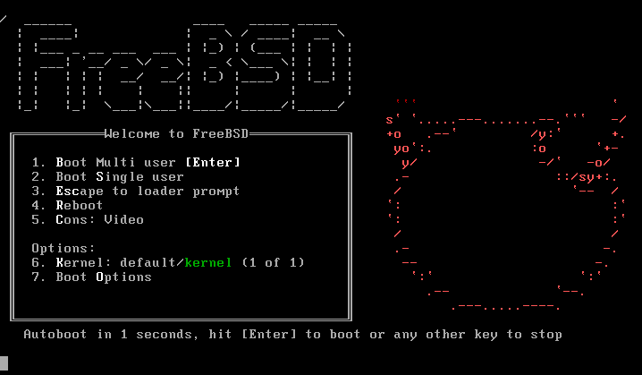

It is recommended to wait ten seconds to enter, or you can enter directly.

| Options | Explanation |
| :----------: | :---------: |
| ACPI Support | ACPI Support. There are many tutorials that say to turn it off if you have problems, but that is actually nonsense. If you turn it off, you will have more problems.
| Safe Mode | Safe Mode
| Single User | Single user mode, to retrieve the root password or repair the disk will be used
| Verbose | Verbose mode, show more output |

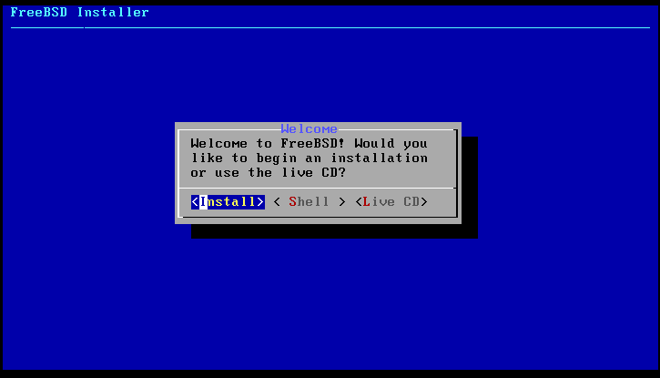

Select `install` and press the `enter` key to install.

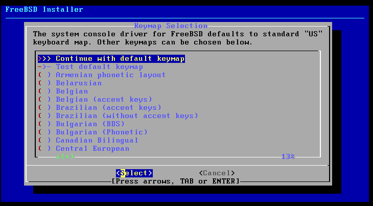

Here is the setup keyboard, just enter directly.

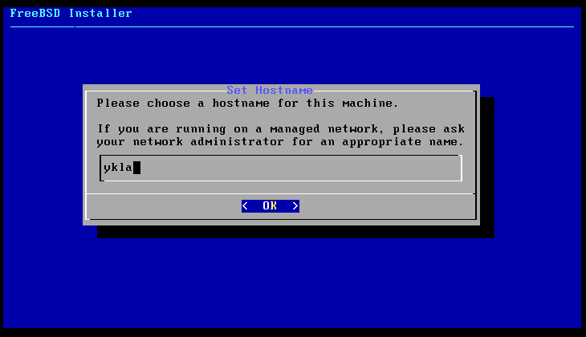

This is to set the hostname.

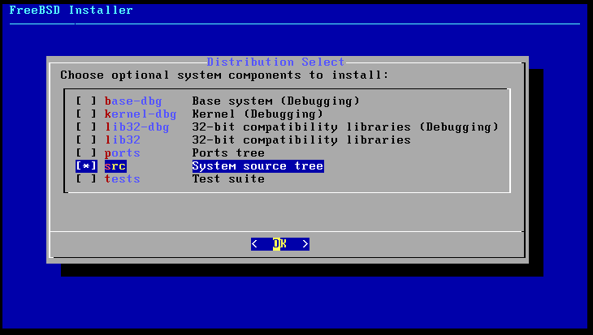

Recommended: `src` and `lib32` only. Some graphics card drivers or other programs need `src`, after testing `lib32` the day after the installation is invalid. It is not recommended to select `ports`, because even if `ports` is selected, it will not be installed, it will still be empty.

| options | explanation |
| :--------: | :-----------------------------------------: |
| base-dbg | activates the base tool for debugging symbols, such as cat, ls, etc. |
| kernel-dbg | Activate kernel and module debug symbols |
| lib32-dbg | Compatibility library for running 32-bit applications on 64-bit versions of FreeBSD with debug symbols activated | lib32 | Compatibility library for running 32-bit applications on 64-bit versions of FreeBSD with debug symbols activated
| lib32 | Compatibility libraries for running 32-bit applications on 64-bit versions of FreeBSD | lib32 | Compatibility libraries for running 32-bit applications on 64-bit versions of FreeBSD
| ports | ports |
| src | system source code |
| tests | test tools |

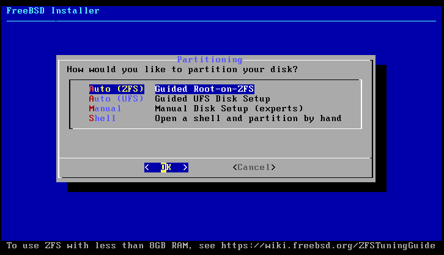

Recommended: File partitioning is explained in Chapter 6. It is recommended to choose auto ZFS/UFS, in general you should choose UFS if you have less than 8GB of RAM, and ZFS if you have 8G of RAM or more. allow manual partitioning to decompress txz files for customization.

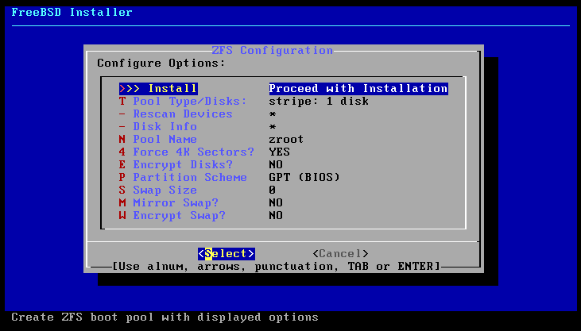

Modern computers should choose GPT+UEFI. older computers (e.g. before 2013) should choose the option to keep it consistent with the picture (GPT(BIOS)).

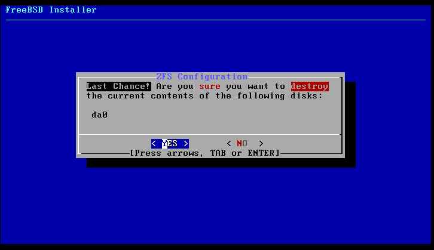

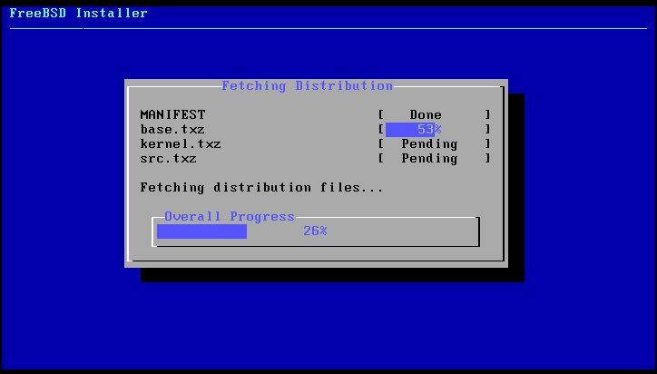

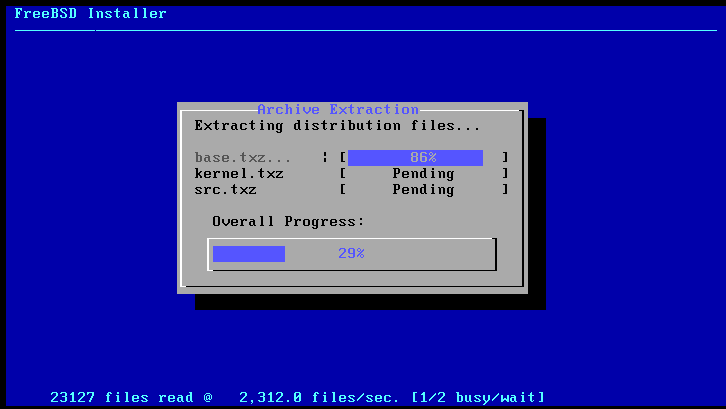

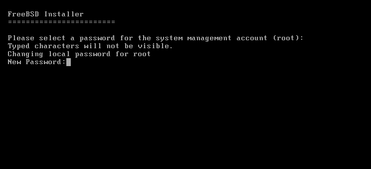

Enter the root password here; it will not be displayed on the screen and will be required to be repeated twice to confirm consistency. Password strength is not required by default.

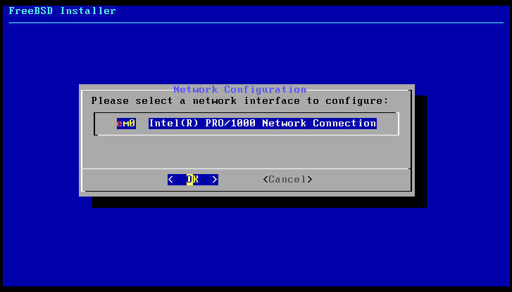

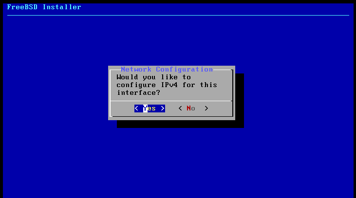

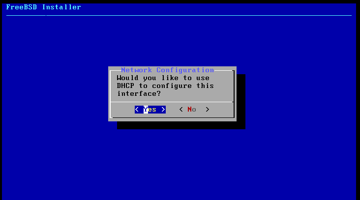

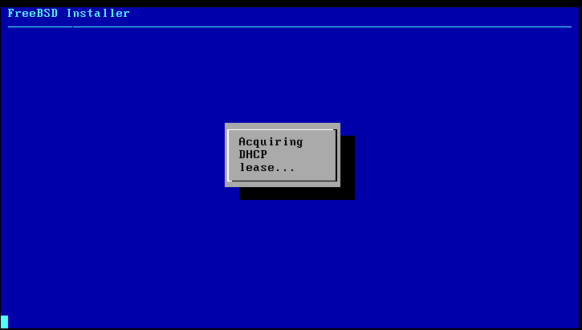

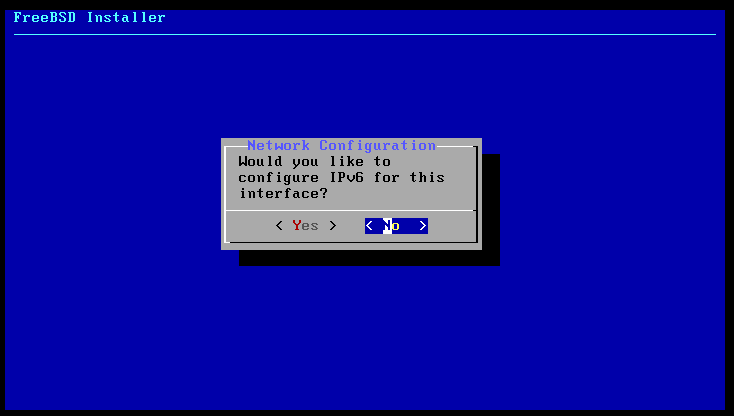

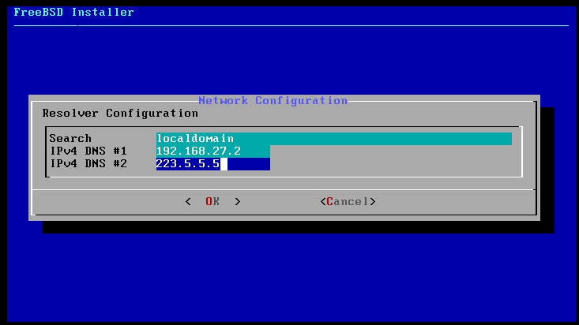

Just keep the DHCP-acquired DNS, or you can use another DNS.

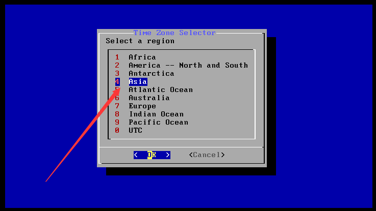

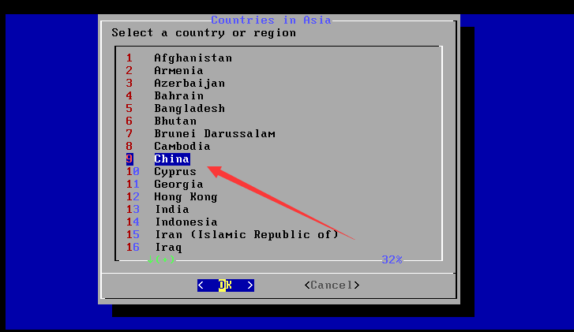

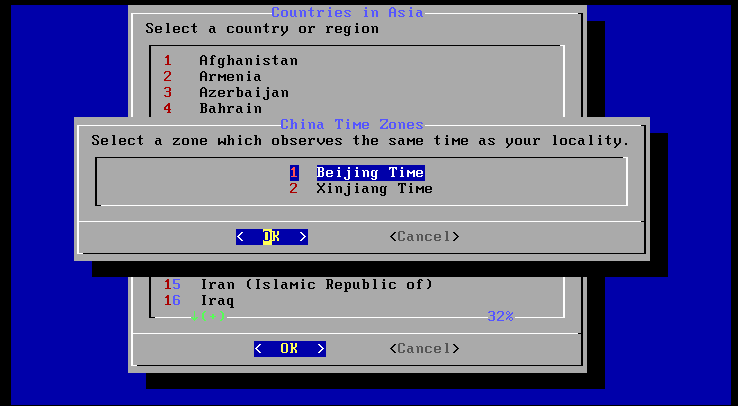

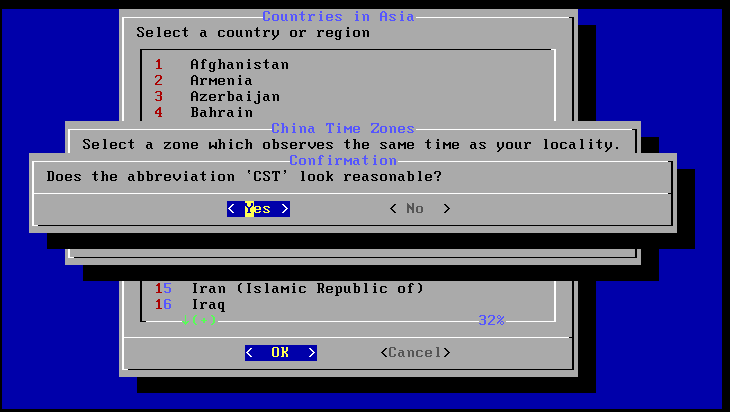

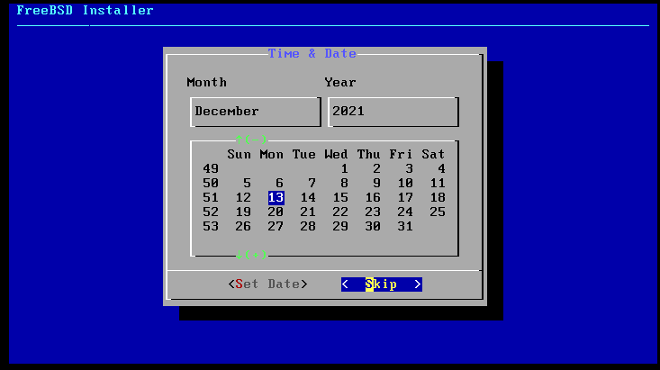

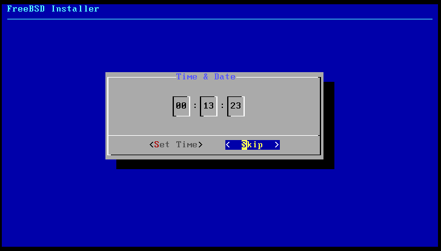

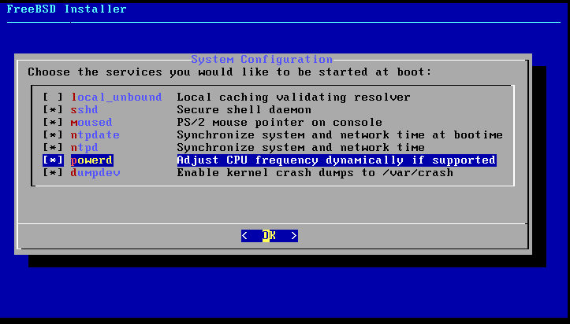

It is not recommended to choose `local_unbound`, it will affect DNS, see [https://bugs.freebsd.org/bugzilla/show\_bug.cgi?id=262290](https://bugs.freebsd.org/bugzilla/show_bug.cgi?id=262290).

The virtual machine does not need to select `powerd`.

| options | explanation |
| :------------: | :---------------------------------------------: |
| local\_unbound | Enables DNS local unbinding. This is the base system preconfigured unbound for local cache forwarding resolver use only. Note: If enabled, your system will not be networked correctly and you will need to configure DNS manually.
| sshd | Turn on the ssh service |
| moused | Show mouse in tty interface |
| ntpdate | Enable automatic clock synchronization at boot time |
| ntpd | The Network Time Protocol (NTP) daemon for automatic clock synchronization |
| powerd | power management |
| dumpdev | Enable crash dumps for debugging the system |

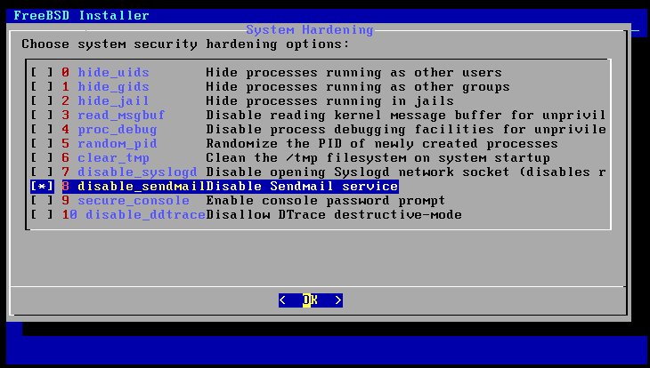

Recommended choice: Here is the security enhancement choice, you should choose `disable_sendmail`, if you do not disable this service will make you stuck for a few minutes every time you boot up, and this service itself is not useful, it is for sending emails.

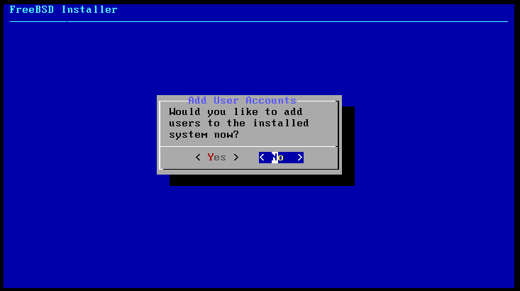

This menu option is used to create a normal user. root daredevil can be ignored. Note that it is best to add the user to the wheel group and leave the other parameters as they are by default. As of FreeBSD 14 and later, all user shells have been standardized to sh.

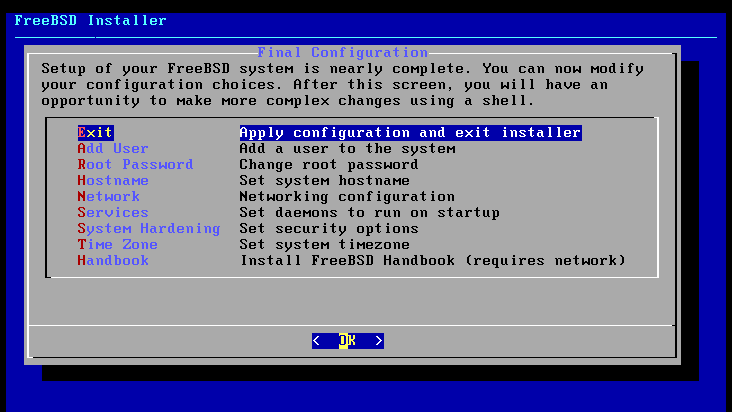

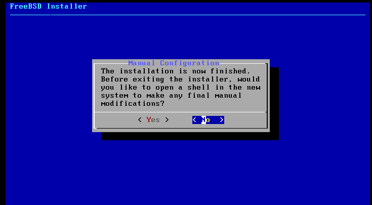

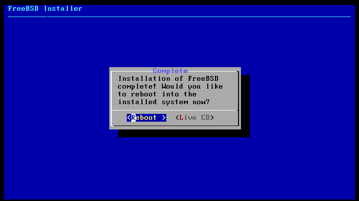
