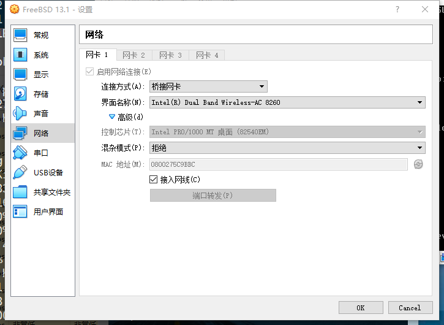
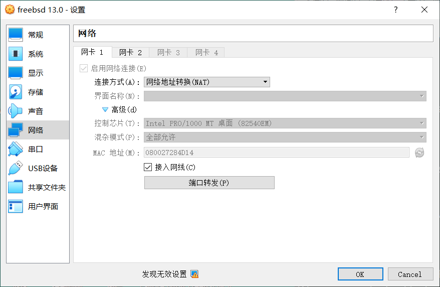
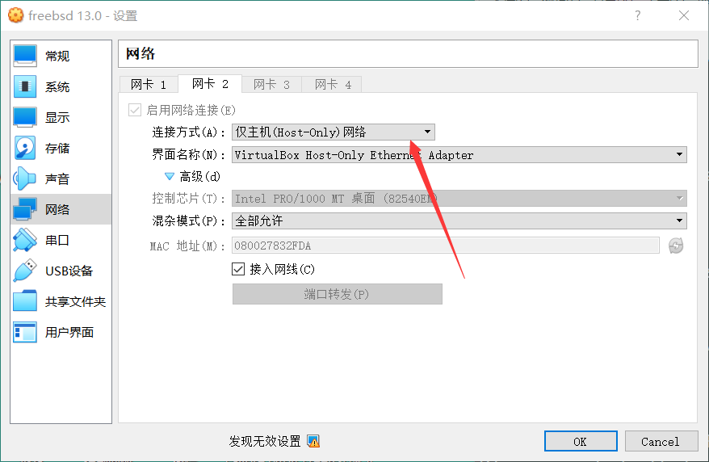

# 2.2 FreeBSD 13.0 Installation - Based on Virtual Box

## Downloading VirtualBox

Click `download` to download.

<https://www.virtualbox.org>

## Installation Setup

After the installation is complete, please manually shut down your computer and uninstall or remove the installation CD, otherwise you will still be at the installation screen.

## Network settings

### Method ① Bridging

Bridging is the simplest way to interoperate between the host and the virtual machine, and can obtain an IP address in the same IP segment as the host, such as the host is 192.168.31.123, the address of the virtual machine is 192.168.31.x. !



After setting `# dhclient em0` you can (for long term effect add `ifconfig_em0="DHCP"` in `/etc/rc.conf`).

If you don't have a network (internet) set DNS to `8.8.8.8`. If not, see other sections in this chapter.

### Method ② NAT

Network setup is complicated, and sometimes bridging does not always work. For the purpose of controlling the FreeBSD system in a virtual machine using a host (e.g. Windows 10), you need to set up two NICs - one in NAT network mode for Internet access and the other in host-only mode for interoperability with the host. As shown in the figure.





Use the command `# ifconfig` to see if the second NIC `em1` is not getting an ip address, please DHCP it manually: `# dhclient em1` to get it (for long term effect add `ifconfig_em1="DHCP"` to `/etc/rc.conf`).

If you don't have a network (internet) set DNS to `8.8.8.8`. If not, see other sections in this chapter.

## Install enhancement tools

```
## pkg install virtualbox-ose-additions
```

xorg can automatically recognize the driver, no need to manually configure `/usr/local/etc/X11/xorg.conf` (after testing the manual configuration but more card, click it takes 5 seconds to move once ......).

Use `VBoxSVGA` for the graphics card controller.

Edit `# ee etc/rc.conf` and add the following.

```
vboxguest_enable="YES"
vboxservice_enable="YES"
```

Start the service and adjust the permissions to.

```
# service vboxguest restart # May indicate that the module is not found, but it does not affect the use
# service vboxservice restart
# pw groupmod wheel -m <yourname> # sudo permissions
# pw groupmod opt -m <yourname> # boot reboot permissions
```

## Troubleshooting
 
If you can't get the mouse in or out, press `ctrl` on the right (there is a `ctrl` on the left and right side of the keyboard, which is the default setting); if you need to restore the auto-scaling screen or can't find the menu bar, press `home` + `ctrl` on the right (hint: the `home` key is under `Scroll Lock` on the 108 keyboard.
