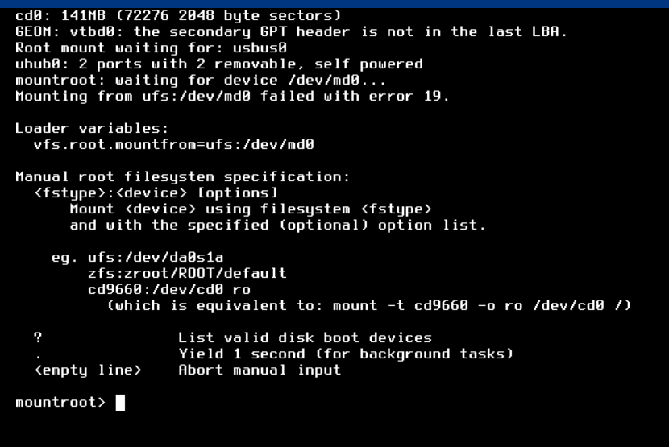
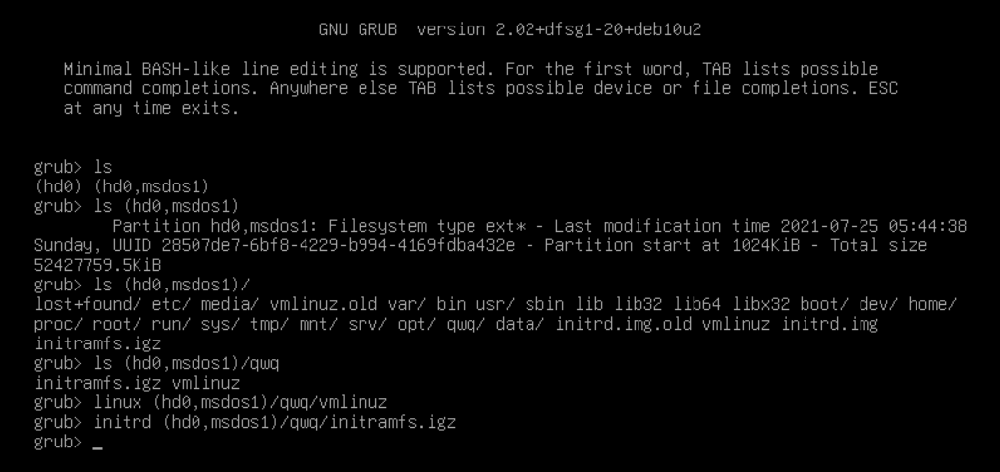

# 2.4 Tencent Cloud Lightweight Cloud and other servers dd Installing FreeBSD

>
>**Note: Although this article has nothing to do with dd, it is not recommended if you don't already know what `dd` is. This is all beyond your hands-on skills and knowledge base.**
>
>**Also, for versions that are no longer supported by security, such as `9.2`, please refer to this article and work with the manual FreeBSD installation section.**

## Video Guideline

http://b23.tv/zcfHa4K

## Text Guideline

Machines such as Tencent Cloud Lightweight and AliCloud do not have support for FreeBSD and can only be installed violently by special methods. **Please be careful with data security, the following tutorials are dangerous and require you to have some hands-on skills.**

He is a server panel without a FreeBSD image IDC, so you have to use a strange method to install it. Because the FreeBSD and Linux kernels are not common and the executables are not common, you cannot install them by chroot and then delete the source system. The installation is done by booting the FreeBSD system on a memory disk, i.e. [mfsBSD](https://mfsbsd.vx.sk), and then formatting the hard disk to install the new system. mfsBSD is a FreeBSD system that is fully loaded into memory, similar to PE in Windows.

We needed to download the [mfsBSD image in img format](https://mfsbsd.vx.sk/files/images/13/amd64/mfsbsd-se-13.0-RELEASE-amd64.img), and I didn't know how well the mfsBSD server was connected in China, so I just transferred the file first I didn't know how the mfsBSD server was connected in China, so I transferred the file to another file server in China first.

### Why can't I dd directly? (Error demonstration, for illustration only, please do not execute)

I tried to dd the mfsBSD img directly to the hard disk in a normal Linux system, and after rebooting, the bootloader loaded normally, but the memory disk could not be mounted properly because the system had written to the hard disk again.

```
# wget https://mfsbsd.vx.sk/files/images/13/amd64/mfsbsd-se-13.0-RELEASE-amd64.img -O- | dd of=/dev/vda
```

`|` here means pipeline, using the standard output of the previous command as the standard input of the next command.
`-O-` means to download the file output to the standard output, while dd will automatically read the content from the standard input when no if is specified.



### The real mfsBSD startup method

It is because of the problem just described, and the fact that FreeBSD is a different ecology than normal Linux, that we need to access a Linux memory disk first, and then write mfsBSD to the hard disk in a Linux running in memory.

Just below the mfsBSD download location, there is [mfsLinux](https://mfsbsd.vx.sk/files/iso/mfslinux/mfslinux-0.1.9-dd4a135.iso), which is the tool we can use. Since it is only in ISO format, it cannot be booted directly in the current environment, and since it says it is pure initrd, we will extract the initrd and kernel to boot it and put it on the hard disk to boot manually.

We know that in a normal Linux system, initrd is a miniature but complete Linux AGVDbNVutgwiep6615bjTJnQkScwWuUEMuU95NredRG5 initrd is loaded by the bootloader, and the script in initrd does the boot preparation and runs the the initialization process on the hard drive.

We first put the kernel and initrd files extracted from the ISO in the root folder, say qwq, and then reboot the machine into the GRUB command line interface (you can press `e` during the countdown to enter edit mode, delete all `linux` and `initrd` lines, and press `Ctrl X` to load them after writing) and manually boot and initrd (you can use the `Tab` key to complete the path).

```
linux (hd0,msdos1)/qwq/vmlinuz
initrd (hd0,msdos1)/qwq/initramfs.igz
boot
```



This special initrd does not load the local system after booting, but connects itself to the network and opens the ssh server. So we get a Linux system running in memory.

At this point the server should be able to be connected by ssh and the hard disk can be safely formatted.

The root password for mfsBSD and mfsLinux images is `mfsroot` by default

```
# cd /tmp
# wget https://mfsbsd.vx.sk/files/images/13/amd64/mfsbsd-se-13.0-RELEASE-amd64.img
# dd if=mfsbsd-se-13.0-RELEASE-amd64.img of=/dev/vda
# reboot
```
**Hint: It is recommended to use the server's "snapshot" feature to backup the server here, in case the following tutorials are missed and delayed.**

### Installing FreeBSD

Once the system has been initialized, you can ssh on, but there is one more step needed to install it properly (otherwise the installation wizard will report an error afterwards)

We also need to download the FreeBSD installation manifest file.

```
# mkdir -p /usr/freebsd-dist
# cd /usr/freebsd-dist
# fetch http://ftp.freebsd.org/pub/FreeBSD/releases/amd64/13.0-RELEASE/MANIFEST
```

Finally, just run `# bsdinstall` for a normal installation (preferably with automatic ufs partitioning).
Please note that most servers, such as the Tencent Lightweight Cloud example in this article, do not support UEFI and still use the traditional BIOS; please also use ufs, zfs installation will cause errors.
