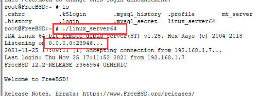
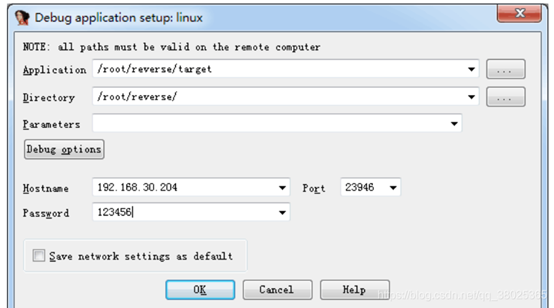
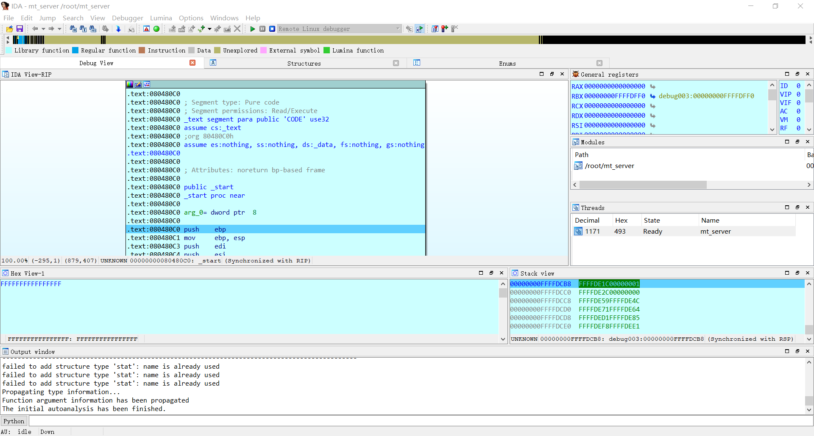

# 22.10 Debugging FreeBSD via IDA 7

**Note: Windows, IDA, FreeBSD, and FreeBSD compatible layers all require 64-bit or they may not work properly.**

First find the `linux_server64` file in the dbgsrv folder in the install path of the IDA on Windwos systems.

Copy it to **FreeBSD**, which can be done with Winscp.

Copy `linux_server64` and the file you need to debug remotely, target (hypothetically), into the `/root/reverse` folder (any folder), give permission `777`, and run `linux_server64`.

And run it, referring to the red box.

Please use **64-bit** IDA, and follow the screenshot below.

The first one is the location of the file to be debugged in the virtual machine.

The second is the path of the file to be debugged in the virtual machine.

Here target is the specific file to be debugged.

The third is the argument to be passed to the main function, which is usually left out.

Then there is the host ip address of the FreeBSD system, the port number to listen on, and the password (i.e. the SSH password, in this case the root user, since the `linux_server64` file runs under the root user).

In the FreeBSD system terminal `ifconfig- a` you can see your ip address

The successful result is as follows.

